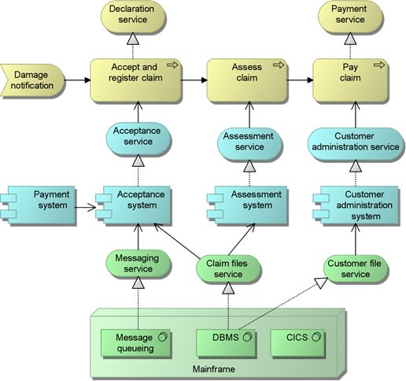

Introducción
=================================
Hoy en dia junto al rapido incremento de la complejidad de los software, es necesario poder representar el sistema completo, usando alguna arquitectura apropiada que nos permita razonar sobre este. En otras palabras, se requiere de una arquitectura capaz de entregarnos una visualizacion clara del software, de esta manera podremos conocer la extension del mismo y a lo que nos estamos enfrentando.

En este documento se registra todo el procedimiento realizado para crear un sistema web que permita visualizar temperatura y humedad en distintos puntos de la ciudad de Temuco - Chile, desde el año 2000 a la fecha. Para estructurar la documentación de manera sencilla y facil de entender, se utilizará la Metodologia Ad-Hoc que consta de 8 fases (Definir stakeholders, Definir vision y objetivos, Crear historias de usuario, Seleccionar historias de usuario, Crear mockups, Diseño, Implementación y Testeo, y Despliegue)

Representación de la Arquitectura
-------------------------------
Para representar el sistema de manera global, se utilizará el modelo de vistas 4+1 que nos permite visualizar el sistema desde diferentes perspectivas.  En cuanto al diseño de estas vistas, se usara el modelo de visualizacion C4 para la Vista Lógica, Archimate para la Vista de Proceso y finalmente UML para las Vistas Fisica y de Desarrollo .

1) C4
~~~~~~~~~~~~~~~~~~~~
Es un modelo que permite diagramar arquitecturas de software basada en abstracciones que reflejan como los desarrolladores piensan y construyen el software.

.. image:: images/c4.png
    :scale: 20%
    :align: center
    
2) Archimate
~~~~~~~~~~~~~~~~~~~~
Es un lenguaje de modelado que permite describir, analizar y visualizar arquitecturas de software dentro de un dominio de negocio.

    
3) UML
~~~~~~~~~~~~~~~~~~~~
Es un lenguaje de modelado de sistemas de software que provee una manera estandar de representar y visualizar el diseño de un sistema.

.. image:: images/uml.png
    :scale: 60%
    :align: center

Stakeholders
-------------------------------
Se han identificado 2 stakeholders que interactuan con el sistema de manera visual. Ambos usuarios ingresarán al sitio web de manera anonima permitiendo a estos visualizar los datos (temperatura y humedad) de manera ordenada, hacer preguntas y responder las de otros.

+---------------------------+--------------------------------------------------------------------------------------------------+
| **Stakeholder**           | **Descripción**                                                                                  |
+---------------------------+--------------------------------------------------------------------------------------------------+
| Usuario Web               | - Usuario que ingresa al sitio web desde un computador.                                          |
|                           | - Puede visualizar datos, hacer y responder preguntas.                                           |
+---------------------------+--------------------------------------------------------------------------------------------------+
| Usuario Móvil             | - Usuario que ingresa al sitio web mediante un telefono móvil.                                   |
|                           | - Puede visualizar datos, hacer y responder preguntas.                                           |
+---------------------------+--------------------------------------------------------------------------------------------------+
| Usuario Moderador         | - Usuario que ingresa al sitio web con privilegios. Puede ser desde Computador o telefono móvil. |
|                           | - Puede eliminar mensajes, banear usuarios, banear palabras y añadir moderadores.                 |                                                                  
+---------------------------+--------------------------------------------------------------------------------------------------+

