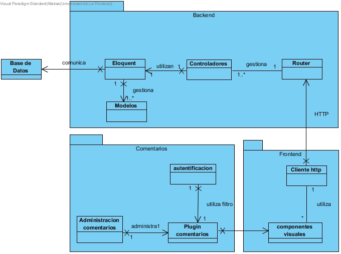

Estructura
=================================

Visión general
--------------

El sistema se divide en 2 componentes, un backend y un frontend. Ademas de trabajar en conjunto con un motor de base de datos y un plugin comercial para el manejo de las preguntas

el backend es una api que recibe y maneja peticiones HTTP considerandose un servicio RESTful con una arquitectura orientada a servicios. Cuenta con un manejador de rutas que asigna las peticiones a los controladore correspondientes, aparte de asignarlo por controlador la asignacion se realiza segun el verbo de la peticion (GET, PUT) a las diferentes funciones dentro de cada controlador. El backend accede a los registros de la base de datos a traves de un ORM que sigue el patron arquitectural de registro activo, el uso del ORM permite la independecia del backend en relacion al motor de la base de datos.

los modelos permiten relacionar la estructura de la base de datos para que el ORM pueda pueda detectar automaticamente las tablas y sus atributos. Las consultas a la base de datos se afectuan a travez de un contructor de consultas, este constructor de consultas  utiliza el enlace de parámetros PDO (PHP Data Objects) para proteger su aplicación contra ataques de inyección de SQL.

el frontend bla bla bla bla

Descripcion de componentes
--------------

a continuacion se describen los componentes de la arquitectura

Componentes Backend
--------------

+---------------------------+-----------------------------------------------------------------------------+
| **Componente**            | Backend                                                                     |
+---------------------------+-----------------------------------------------------------------------------+
| **Responsabilidades**     | - recibe y maneja las peticiones enviadas desde el frontend                 |
|                           |                                                                             |
+---------------------------+-----------------------------------------------------------------------------+
| **Colaboradores**         | - **Componente:** frontend                                                  |
|                           | - **Componente:** Base_de_Datos                                             |
+---------------------------+-----------------------------------------------------------------------------+
| **Notas**                 | El componente se crea una sola vez y persiste durante todo el tiempo.       |
|                           |                                                                             |
+---------------------------+-----------------------------------------------------------------------------+
| **Problemas**             |                                                                             |
+---------------------------+-----------------------------------------------------------------------------+

+---------------------------+-----------------------------------------------------------------------------+
| **Componente**            | Backend_Router                                                              |
+---------------------------+-----------------------------------------------------------------------------+
| **Responsabilidades**     | - recibe y reparte hacia los controladores las peticiones enviadas desde el |
|                           |   frontend                                                                  |
+---------------------------+-----------------------------------------------------------------------------+
| **Colaboradores**         | - **Componente:** Cliente_HTTP                                              |
|                           | - **Componente:** Controladores                                             |
+---------------------------+-----------------------------------------------------------------------------+
| **Notas**                 | El componente se crea una sola vez y persiste durante todo el tiempo.       |
|                           |                                                                             |
+---------------------------+-----------------------------------------------------------------------------+
| **Problemas**             |                                                                             |
+---------------------------+-----------------------------------------------------------------------------+

+---------------------------+-----------------------------------------------------------------------------+
| **Componente**            | Backend_Controladores                                                       |
+---------------------------+-----------------------------------------------------------------------------+
| **Responsabilidades**     | - reciben solicitudes y en base a eso generar una respuesta dependiendo     |
|                           |   del tipo de solicitud                                                     |
+---------------------------+-----------------------------------------------------------------------------+
| **Colaboradores**         | - **Componente:** Cliente_HTTP                                              |
|                           | - **Componente:** Controladores                                             |
+---------------------------+-----------------------------------------------------------------------------+
| **Notas**                 | El componente se crea una sola vez y persiste durante todo el tiempo.       |
|                           |                                                                             |
+---------------------------+-----------------------------------------------------------------------------+
| **Problemas**             |                                                                             |
+---------------------------+-----------------------------------------------------------------------------+

+---------------------------+-----------------------------------------------------------------------------+
| **Componente**            | Backend_Eloquent                                                            |
+---------------------------+-----------------------------------------------------------------------------+
| **Responsabilidades**     | - servir como interfaz entre la base de datos y los controladores,          |
|                           |   ayuda a mantener la consitencia de los datos                              |
+---------------------------+-----------------------------------------------------------------------------+
| **Colaboradores**         | - **Componente:** Cliente_HTTP                                              |
|                           | - **Componente:** Controladores                                             |
+---------------------------+-----------------------------------------------------------------------------+
| **Notas**                 | El componente se crea una sola vez y persiste durante todo el tiempo.       |
|                           |                                                                             |
+---------------------------+-----------------------------------------------------------------------------+
| **Problemas**             |                                                                             |
+---------------------------+-----------------------------------------------------------------------------+

+---------------------------+-----------------------------------------------------------------------------+
| **Componente**            | Backend_Query_Builder                                                       |
+---------------------------+-----------------------------------------------------------------------------+
| **Responsabilidades**     | - facilitar la sintaxis de la creacion de consultas hacia la base de datos  |
|                           |   y ayudar en la seguridad impidiendo inyecciones SQL                       |
+---------------------------+-----------------------------------------------------------------------------+
| **Colaboradores**         | - **Componente:** Eloquent                                                  |
|                           |                                                                             |
+---------------------------+-----------------------------------------------------------------------------+
| **Notas**                 | El componente se crea una sola vez y persiste durante todo el tiempo.       |
|                           |                                                                             |
+---------------------------+-----------------------------------------------------------------------------+
| **Problemas**             |                                                                             |
+---------------------------+-----------------------------------------------------------------------------+

+---------------------------+-----------------------------------------------------------------------------+
| **Componente**            | Backend_Modelos                                                             |
+---------------------------+-----------------------------------------------------------------------------+
| **Responsabilidades**     | - facilitar la comprension de la estructura y forma de lo datos a obtener   |
|                           |   u almacenar en la base de datos                                           |
+---------------------------+-----------------------------------------------------------------------------+
| **Colaboradores**         | - **Componente:** Eloquent                                                  |
|                           |                                                                             |
+---------------------------+-----------------------------------------------------------------------------+
| **Notas**                 | El componente se crea una sola vez y persiste durante todo el tiempo.       |
|                           |                                                                             |
+---------------------------+-----------------------------------------------------------------------------+
| **Problemas**             |                                                                             |
+---------------------------+-----------------------------------------------------------------------------+

Componente Base de Datos
--------------

+---------------------------+-----------------------------------------------------------------------------+
| **Componente**            | Backend_Modelos                                                             |
+---------------------------+-----------------------------------------------------------------------------+
| **Responsabilidades**     | - facilitar la comprension de la estructura y forma de lo datos a obtener   |
|                           |   u almacenar en la base de datos                                           |
+---------------------------+-----------------------------------------------------------------------------+
| **Colaboradores**         | - **Componente:** Eloquent                                                  |
|                           |                                                                             |
+---------------------------+-----------------------------------------------------------------------------+
| **Notas**                 | El componente se crea unicamente una vez y la instancia se mantiene durante |
|                           | todo el tiempo.                                                             |
+---------------------------+-----------------------------------------------------------------------------+
| **Problemas**             |                                                                             |
+---------------------------+-----------------------------------------------------------------------------+

Frontend
--------------

+---------------------------+-----------------------------------------------------------------------------+
| **Componente**            | Frontend                                                                    |
+---------------------------+-----------------------------------------------------------------------------+
| **Responsabilidades**     | - despliega informacion al usuario y responde a sus entradas                |
|                           |                                                                             |
+---------------------------+-----------------------------------------------------------------------------+
| **Colaboradores**         | - **Componente:** Backend                                                   |
|                           | - **Componente:** Plugin_comentarios                                        |
+---------------------------+-----------------------------------------------------------------------------+
| **Notas**                 | El componente se crea cada una solo vez y persiste durante el tiempo        |
|                           |                                                                             |
+---------------------------+-----------------------------------------------------------------------------+
| **Problemas**             |                                                                             |
+---------------------------+-----------------------------------------------------------------------------+

+---------------------------+-----------------------------------------------------------------------------+
| **Componente**            | Frontend_Cliente_HTPP                                                       |
+---------------------------+-----------------------------------------------------------------------------+
| **Responsabilidades**     | - realizar peticiones HTTP hacia el backend                                 |
|                           |                                                                             |
+---------------------------+-----------------------------------------------------------------------------+
| **Colaboradores**         | - **Componente:** Backend_Router                                            |
|                           |                                                                             |
+---------------------------+-----------------------------------------------------------------------------+
| **Notas**                 | El componente se crea cada vez que se quiere realizar una peticion htpp     |
|                           |                                                                             |
+---------------------------+-----------------------------------------------------------------------------+
| **Problemas**             |                                                                             |
+---------------------------+-----------------------------------------------------------------------------+

+---------------------------+-----------------------------------------------------------------------------+
| **Componente**            | Frontend_Componentes_visuales                                               |
+---------------------------+-----------------------------------------------------------------------------+
| **Responsabilidades**     | - despliega toda la informacion al usuario, contienen y encapsulan lo que   |
|                           |   el usuario ve y con lo que interactua                                     |
+---------------------------+-----------------------------------------------------------------------------+
| **Colaboradores**         | - **Componente:** Backend_Router                                            |
|                           |                                                                             |
+---------------------------+-----------------------------------------------------------------------------+
| **Notas**                 | El componente se crea se crea una vez y persiste durante la ejecucion del   |
|                           | sistema                                                                     |
+---------------------------+-----------------------------------------------------------------------------+
| **Problemas**             |                                                                             |
+---------------------------+-----------------------------------------------------------------------------+

Comentarios
--------------

+---------------------------+-----------------------------------------------------------------------------+
| **Componente**            | Comentarios                                                                 |
+---------------------------+-----------------------------------------------------------------------------+
| **Responsabilidades**     | - permite realizar preguntas y contestar las que otros usuaros han hecho    |
|                           |                                                                             |
+---------------------------+-----------------------------------------------------------------------------+
| **Colaboradores**         | - **Componente:** Frontend_Componentes_visuales                             |
|                           |                                                                             |
+---------------------------+-----------------------------------------------------------------------------+
| **Notas**                 | El componente se crea se crea una vez y persiste durante la ejecucion del   |
|                           | sistema                                                                     |
+---------------------------+-----------------------------------------------------------------------------+
| **Problemas**             |                                                                             |
+---------------------------+-----------------------------------------------------------------------------+

+---------------------------+-----------------------------------------------------------------------------+
| **Componente**            | Plugin_Comentarios                                                          |
+---------------------------+-----------------------------------------------------------------------------+
| **Responsabilidades**     | - permite implementar e integrar el plugin en los componentes visuales      |
|                           |                                                                             |
+---------------------------+-----------------------------------------------------------------------------+
| **Colaboradores**         | - **Componente:** Frontend_Componentes_visuales                             |
|                           |                                                                             |
+---------------------------+-----------------------------------------------------------------------------+
| **Notas**                 | El componente se crea se crea una vez y persiste durante la ejecucion del   |
|                           | sistema                                                                     |
+---------------------------+-----------------------------------------------------------------------------+
| **Problemas**             |                                                                             |
+---------------------------+-----------------------------------------------------------------------------+

+---------------------------+-----------------------------------------------------------------------------+
| **Componente**            | Autentificacion                                                             |
+---------------------------+-----------------------------------------------------------------------------+
| **Responsabilidades**     | - permite autenticarse en la pagina para poder interactuar con las preguntas|
|                           |   y respuestas                                                              |
+---------------------------+-----------------------------------------------------------------------------+
| **Colaboradores**         | - **Componente:** Frontend_Componentes_visuales                             |
|                           |                                                                             |
+---------------------------+-----------------------------------------------------------------------------+
| **Notas**                 | El componente se crea se crea una vez y persiste durante la ejecucion del   |
|                           | sistema                                                                     |
+---------------------------+-----------------------------------------------------------------------------+
| **Problemas**             |                                                                             |
+---------------------------+-----------------------------------------------------------------------------+

+---------------------------+-----------------------------------------------------------------------------+
| **Componente**            | Administracion_Comentarios                                                  |
+---------------------------+-----------------------------------------------------------------------------+
| **Responsabilidades**     | - permite administrar las preguntas, ya sea restrigiendo palabras o         |
|                           |   a usuarios en especifico                                                  |
+---------------------------+-----------------------------------------------------------------------------+
| **Colaboradores**         | - **Componente:** Comentarios_Plugin_Comentarioos                           |
|                           |                                                                             |
+---------------------------+-----------------------------------------------------------------------------+
| **Notas**                 | El componente existe ajeno a la ejecucion del sistema                       |
|                           |                                                                             |
+---------------------------+-----------------------------------------------------------------------------+
| **Problemas**             |                                                                             |
+---------------------------+-----------------------------------------------------------------------------+