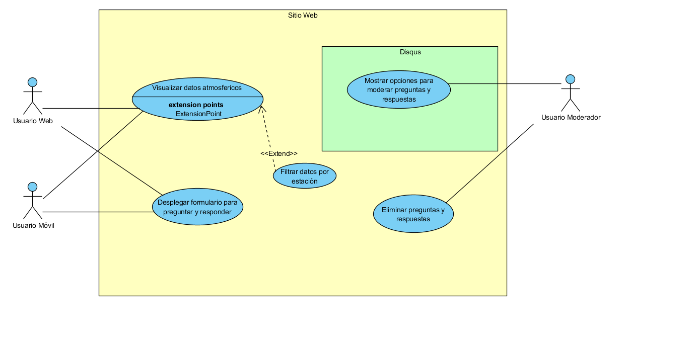

Comportamiento Dinámico
==============

Escenarios
------------
El siguiente diagrama de casos de usos nos permite especificar como actua la arquitectura en diferentes escenarios. De igual manera, es el item central usado en el modelo de vistas 4+1.

Especificación de Escenarios
-------------
A continuación se detalla cada caso de uso.

1. Visualizar Datos Atmosfericos
~~~~~~~~~~~~

+------------------+--------------------------------------------------------------------------------------------------------+
| **Caso de Uso**  | Visualizar Datos Atmosfericos                                                                          |
+------------------+--------------------------------------------------------------------------------------------------------+
| **Descripción**  | Muestra temperatura y humedad en forma de graficas.                                                    |
+------------------+--------------------------------------------------------------------------------------------------------+
| **Actores**      | Usuario Web, Usuario Móvil                                                                             |
+------------------+--------------------------------------------------------------------------------------------------------+
| **Pasos**        | 1. El Usuario ingresa al sitio web.                                                                    |
|                  | 2. El Usuario selecciona la fecha que desea visualizar.                                                |
|                  | 3. El Usuario presiona el botón "Consultar"                                                            |
|                  | 4. El sistema accede a la base de datos para obtener los datos atmosfericos del periodo seleccionado.  |
|                  | 5. Se despliegan los graficos correspondientes.                                                        |
+------------------+--------------------------------------------------------------------------------------------------------+

2. Desplegar formulario para preguntar y responder
~~~~~~~~~~~~

+------------------+--------------------------------------------------------------------------------------------------------+
| **Caso de Uso**  | Desplegar formulario para preguntar y responder                                                        |
+------------------+--------------------------------------------------------------------------------------------------------+
| **Descripción**  | Da la opción al usuario de hacer una pregunta y responder a una pregunta.                              |
+------------------+--------------------------------------------------------------------------------------------------------+
| **Actores**      | Usuario Web, Usuario Móvil                                                                             |
+------------------+--------------------------------------------------------------------------------------------------------+
| **Pasos**        | 1. El Usuario ingresa al sitio web.                                                                    |
|                  | 2. El Usuario se dirije a la pestaña de preguntas.                                                     |
|                  | 3. El Usuario escribe la pregunta o respuesta junto a su nombre.                                       |
|                  | 4. El sistema registra la pregunta o respuesta en su base de datos.                                    |
+------------------+--------------------------------------------------------------------------------------------------------+

3. Filtrar datos por estación
~~~~~~~~~~~~

+------------------+--------------------------------------------------------------------------------------------------------+
| **Caso de Uso**  | Filtrar datos por estación                                                                             |
+------------------+--------------------------------------------------------------------------------------------------------+
| **Descripción**  | Permite la seleccion de una de las diferentes estaciones de la ciudad de Temuco.                       |
+------------------+--------------------------------------------------------------------------------------------------------+
| **Actores**      | Usuario Web, Usuario Móvil                                                                             |
+------------------+--------------------------------------------------------------------------------------------------------+
| **PreCondición** | Visualizar Datos Atmosfericos                                                                          |
+------------------+--------------------------------------------------------------------------------------------------------+
| **Pasos**        | 1. El Usuario selecciona la estación a visualizar.                                                     |
|                  | 2. El Usuario presiona el botón "Consultar"                                                            |
|                  | 3. El sistema accede a la base de datos para obtener los datos atmosfericos de estación seleccionada.  |
|                  | 4. Se despliegan los graficos correspondientes.                                                        |
+------------------+--------------------------------------------------------------------------------------------------------+

4. Mostrar opciones para moderar preguntas y respuestas
~~~~~~~~~~~~

+------------------+--------------------------------------------------------------------------------------------------------+
| **Caso de Uso**  | Mostrar opciones para moderar preguntas y respuestas                                                   |
+------------------+--------------------------------------------------------------------------------------------------------+
| **Descripción**  | Permite al moderador aprobar, editar, eliminar y filtrar preguntas y respuestas.                       |
+------------------+--------------------------------------------------------------------------------------------------------+
| **Actores**      | Usuario Moderador                                                                                      |
+------------------+--------------------------------------------------------------------------------------------------------+
| **Pasos**        | 1. El Usuario accede con su cuenta al panel de Disqus.                                                 |
|                  | 2. El Usuario selecciona la opción de moderación que desee.                                            |
+------------------+--------------------------------------------------------------------------------------------------------+

5. Eliminar preguntas y respuestas
~~~~~~~~~~~~

+------------------+--------------------------------------------------------------------------------------------------------+
| **Caso de Uso**  | Eliminar preguntas y respuestas                                                                        |
+------------------+--------------------------------------------------------------------------------------------------------+
| **Descripción**  | Permite al moderador eliminar preguntas y respuestas directamente desde el sitio web.                  |
+------------------+--------------------------------------------------------------------------------------------------------+
| **Actores**      | Usuario Moderador                                                                                      |
+------------------+--------------------------------------------------------------------------------------------------------+
| **Pasos**        | 1. El Usuario accede con su cuenta al panel de Disqus.                                                 |
|                  | 2. El Usuario accede al sitio web.                                                                     |
|                  | 3. El Usuario selecciona una pregunta o comentario y la elimina.                                       |
+------------------+--------------------------------------------------------------------------------------------------------+
