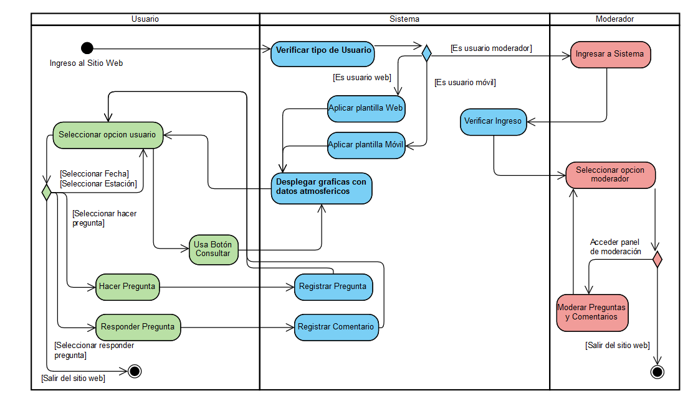
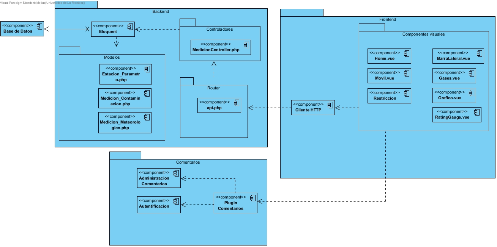
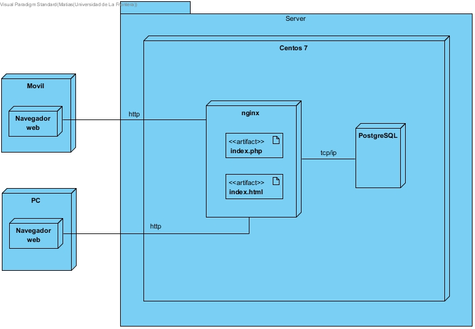

Otras Vistas
==========================

Vista de Proceso
--------------------
La vista de proceso muestra como se comunican los procesos del sistema basandose en tiempo de ejecución. Para representarla se utiliza un diagrama de actividad UML.

Vista Lógica
--------------------
La vista lógica esta encargada de descibrir la estructura y funcionalidad del sistema. Para representarla se un diagrama de _____ UML.

Vista de Desarrollo
--------------------
La vista de desarrollo permite la visualización de los artefactos de software utilizados. Para representarla se utiliza  un diagrama de componentes UML.

Vista Física
--------------------
La vista física se centra en los componentes de software utilizados en la capa fisica y sus conexiones. Para representarla se utiliza un diagrama de despliegue UML.

