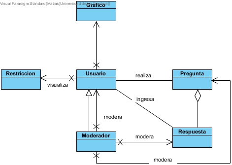

Marco Conceptual
=====

Dominio Léxico
--------------
- **Medicion**: es un registro tanto del clima como de la contaminacion realizada en cierta fecha y en cierta estacion.
- **Pregunta**: Es una interaccion de un usuario con el sistema para dejar registro de una duda sobre el clima, solo puede ser creada por un usuario registrado.
- **Respuesta**: Es un registro que puede ser creado por cualquier tipo de usuario, para poder responder una pregunta.
- **Moderador**: Un tipo de usuario que puede gestionar las cuentas de usuario del sistema, y moderar/sancionar preguntas y respuestas indebidas.
- **Usuario**: Cualquier tipo de persona que utiliza el sistema
- **Grafico**: representacion visual de los datos solicitados por el usuario 
- **Restriccion**: alerta de la existencia de reestricciones a la combustion en el area de temuco y padre las casas

Diagrama Léxico
---------------

Restricciones
~~~~~~~~~~~~~
- Una **Pregunta** o **Respuesta** puede ser retenida hasta que el moderador la aprueba segun si contiene o no palabras prohibidas
- En caso de que no exista una **Medicion** en la fecha seleccionada, el gráfico puede mostrarse vacío.