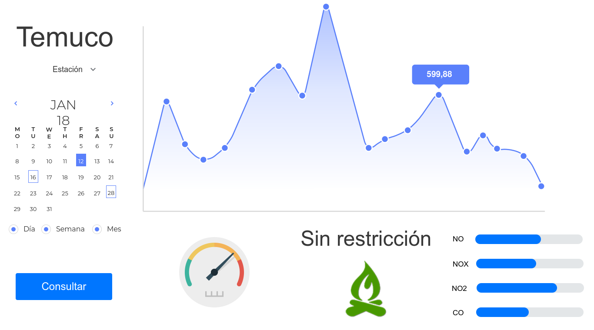

Metodología AD-HOC
=================================

.. image:: images/AD-HOC.png
    :scale: 20%
    :align: center
    

Contexto y Vision
--------------
El sistema construido pretende ofrecer al usuario una forma sencilla y organizada de ver datos de temperatura y humedad en la ciudad de Temuco - Chile. Disponer de graficos y tablas interactivas hacen al sitio web mucho mas agradable de usar, dandole la oportunidad al usuario de aplicar diferentes filtros que permitan agrupar los datos de varias maneras. Por otro lado, el sitio web ofrece al usuario poder realizar preguntas especificas con respecto al clima en la ciudad, que son visibles para todos, las cuales pueden ser respondidas por cualquier otro usuario.

Objetivos
--------------
1. Permitir la visualización organizada de tanto temperatura como humedad en distintos puntos de la ciudad de Temuco desde el año 2004 hasta la fecha.
2. Mostrar datos climaticos categorizados por fecha (dia, semana y mes).
3. Permitir la inserción de preguntas en el sitio web y que estas puedan ser respondidas por otros usuarios.

Stakeholders
-------------------------------
Se han identificado 3 stakeholders que interactuan con el sistema de manera visual. Tanto usuario web como usuario móvil ingresarán al sitio web de manera anonima permitiendo a estos visualizar los datos (temperatura y humedad) de manera ordenada, hacer preguntas y responder las de otros. Por otro lado el usuario moderador tendra que ingresar con su cuenta para poder modearar sobre estas preguntas y comentarios.

+---------------------------+--------------------------------------------------------------------------------------------------+
| **Stakeholder**           | **Descripción**                                                                                  |
+---------------------------+--------------------------------------------------------------------------------------------------+
| Usuario Web               | - Usuario que ingresa al sitio web desde un computador.                                          |
|                           | - Puede visualizar datos, hacer y responder preguntas.                                           |
+---------------------------+--------------------------------------------------------------------------------------------------+
| Usuario Móvil             | - Usuario que ingresa al sitio web mediante un telefono móvil.                                   |
|                           | - Puede visualizar datos, hacer y responder preguntas.                                           |
+---------------------------+--------------------------------------------------------------------------------------------------+
| Usuario Moderador         | - Usuario que ingresa al sitio web con privilegios. Puede ser desde Computador o telefono móvil. |
|                           | - Puede eliminar mensajes, banear usuarios, banear palabras y añadir moderadores.                |                                                                  
+---------------------------+--------------------------------------------------------------------------------------------------+

Historias de Usuario
--------------
Para representar de mejor manera lo que se puede hacer con el sistema se definen algunas historias de usuario que muestran los pasos que puede seguir un usuario cualquiera.

1. **HU Usuario Web 1:** El usuario busca conocer la temperatura y humedad de la semana pasada.
2. **HU Usuario Web 2:** El usuario desea responder una pregunta hecha por un usuario.
3. **HU Usuario Web 3:** El usuario busca conocer las temperaturas mas altas de un mes en especifico.

1. **HU Usuario Móvil 1:** El usuario desea hacer una pregunta sobre el clima en Temuco.
2. **HU Usuario Móvil 2:** El usuario busca conocer si el dia de hoy hay restricción o no.
3. **HU Usuario Móvil 3:** El usuario busca conocer el pronostico del tiempo para los proximos dias.

1. **HU Usuario Moderador 1:** El moderador desea conocer cuantas preguntas se hicieron en un dia.
2. **HU Usuario Moderador 2:** El moderador desea eliminar los comentarios de otro usuario.

Selección de Historias de Usuario
--------------
Para la selección de las historias de usuarios mas apropiadas se considerarán 4 aspectos: 

1. **Prioridad:** Indica que tan importante es la historia para el sistema. Va del 1 al 5 (1 = Muy Alta Prioridad, 5 = Muy Baja Prioridad)
2. **Riesgo:** Indica posibles riesgos que pueden ocurrir a futuro con la historia. Va del 1 al 5 (1 = Muy Bajo Riesgo, 5 = Muy Alto Riesgo)
3. **Tiempo:** Indica que tanto tiempo se le debe dedicar a implementar la historia. Va del 1 al 5 (1 = Muy Baja cantidad de Tiempo, 5 = Muy Alta cantidad de Tiempo)
4. **Dificultad:** Indica la dificultad de implementación de la historia. Va del 1 al 5 (1 = Muy Baja Dificultad, 5 = Muy Alta Dificultad)

Luego, se evalua cada aspecto de las historias de usuarios. Mientras menor es el valor total (suma del valor de cada aspecto), mas viable es la historia de usuario, y mas probable implementarla.

Historias de Usuarios Web
~~~~~~~~~

+------------------------------------+----------------+-------------+-------------+-----------------+-----------+
| **Historia de Usuario**            | **Prioridad**  | **Riesgo**  | **Tiempo**  | **Dificultad**  | **Total** |
+------------------------------------+----------------+-------------+-------------+-----------------+-----------+
| HU Usuario Web 1                   | 1              | 2           | 2           | 3               | 8         |
+------------------------------------+----------------+-------------+-------------+-----------------+-----------+
| HU Usuario Web 2                   | 1              | 1           | 2           | 2               | 6         |
+------------------------------------+----------------+-------------+-------------+-----------------+-----------+
| HU Usuario Web 3                   | 3              | 2           | 3           | 4               | 12        |
+------------------------------------+----------------+-------------+-------------+-----------------+-----------+

En este punto, se usaran las historias de usuario **HU Usuario Web 1** y **HU Usuario Web 2** debido a su bajo valor total y su alta prioridad. En cambio, la historia **HU Usuario Web 3** se descarta porque no es algo que tenga mucho impacto en el sistema, ademas de la complejidad de agregar nuevos filtros y metodos que permitan conocer las temperaturas mas altas.

Historias de Usuarios Móviles
~~~~~~~~~

+------------------------------------+----------------+-------------+-------------+-----------------+-----------+
| **Historia de Usuario**            | **Prioridad**  | **Riesgo**  | **Tiempo**  | **Dificultad**  | **Total** |
+------------------------------------+----------------+-------------+-------------+-----------------+-----------+
| HU Usuario Móvil 1                 | 1              | 1           | 2           | 2               | 6         |
+------------------------------------+----------------+-------------+-------------+-----------------+-----------+
| HU Usuario Móvil 2                 | 4              | 1           | 1           | 1               | 7         |
+------------------------------------+----------------+-------------+-------------+-----------------+-----------+
| HU Usuario Móvil 3                 | 3              | 1           | 4           | 5               | 13        |
+------------------------------------+----------------+-------------+-------------+-----------------+-----------+

En este punto, se usaran las historias de usuario **HU Usuario Móvil 1** debido a su alta prioridad y **HU Usuario Móvil 2** debido a su facilidad de implementación. La historia **HU Usuario Móvil 3** se descarta puesto que es una tarea compleja que implicaria utilizar APIs de algun otro sitio meteorologico. Ademas, no es un requisito de alta prioridad.

Historias de Usuarios Moderadores
~~~~~~~~~

+------------------------------------+----------------+-------------+-------------+-----------------+-----------+
| **Historia de Usuario**            | **Prioridad**  | **Riesgo**  | **Tiempo**  | **Dificultad**  | **Total** |
+------------------------------------+----------------+-------------+-------------+-----------------+-----------+
| HU Usuario Moderador 1             | 4              | 1           | 2           | 3               | 10        |
+------------------------------------+----------------+-------------+-------------+-----------------+-----------+
| HU Usuario Moderador 2             | 3              | 1           | 1           | 1               | 6         |
+------------------------------------+----------------+-------------+-------------+-----------------+-----------+

En este punto, se usa solamente la historia de usuario **HU Usuario Moderador 2**. A pesar de que tenga una prioridad media, los demas aspectos permiten que sea facil de implementar. Por otro lado, la historia **HU Usuario Moderador 1** implica crear nuevos metodos, que si bien no son tan complejos, seria una caracteristica adicional no prioritaria que atrasaria el proyecto.

Representación de Historias Seleccionadas
~~~~~~~~~~~~~
Para visualizar las 5 historias seleccionadas de mejor manera, se muestran en forma de tabla.

1. **HU Usuario Web 1**

+---------------------------+---------------------------------------------------------------------------+
| **Numero:** 1             | **Usuario:** Usuario Web                                                  |
+---------------------------+---------------------------------------------------------------------------+
| **Nombre Historia:** Revisar Temperatura y Humedad                                                    |
+--------------------------+-----------------------+-----------------------+----------------------------+
| **Prioridad:** Muy Alta  | **Riesgo:** Bajo      | **Tiempo:** Bajo      | **Dificultad:** Media      |
+--------------------------+-----------------------+-----------------------+----------------------------+
| **Descripción:** El usuario busca conocer la temperatura y humedad de la semana pasada.               |
+-------------------------------------------------------------------------------------------------------+

2. **HU Usuario Web 2**

+---------------------------+---------------------------------------------------------------------------+
| **Numero:** 2             | **Usuario:** Usuario Web                                                  |
+---------------------------+---------------------------------------------------------------------------+
| **Nombre Historia:** Responder Pregunta                                                               |
+--------------------------+-----------------------+-----------------------+----------------------------+
| **Prioridad:** Muy Alta  | **Riesgo:** Muy Bajo  | **Tiempo:** Bajo      | **Dificultad:** Baja       |
+--------------------------+-----------------------+-----------------------+----------------------------+
| **Descripción:** El usuario desea responder una pregunta hecha por un usuario.                        |
+-------------------------------------------------------------------------------------------------------+

3. **HU Usuario Móvil 1**

+---------------------------+---------------------------------------------------------------------------+
| **Numero:** 3             | **Usuario:** Usuario Móvil                                                |
+---------------------------+---------------------------------------------------------------------------+
| **Nombre Historia:** Hacer Pregunta                                                                   |
+--------------------------+-----------------------+-----------------------+----------------------------+
| **Prioridad:** Muy Alta  | **Riesgo:** Muy Bajo  | **Tiempo:** Bajo      | **Dificultad:** Baja       |
+--------------------------+-----------------------+-----------------------+----------------------------+
| **Descripción:** El usuario desea hacer una pregunta sobre el clima en Temuco.                        |
+-------------------------------------------------------------------------------------------------------+

4. **HU Usuario Móvil 2**

+---------------------------+---------------------------------------------------------------------------+
| **Numero:** 4             | **Usuario:** Usuario Móvil                                                |
+---------------------------+---------------------------------------------------------------------------+
| **Nombre Historia:** Revisar Restricción                                                              |
+--------------------------+-----------------------+------------------------+---------------------------+
| **Prioridad:** Baja      | **Riesgo:** Muy Bajo  | **Tiempo:** Muy Bajo   | **Dificultad:** Muy Baja  |
+--------------------------+-----------------------+------------------------+---------------------------+
| **Descripción:** El usuario busca conocer si el dia de hoy hay restricción o no.                      |
+-------------------------------------------------------------------------------------------------------+

5. **HU Usuario Moderador 2**

+---------------------------+---------------------------------------------------------------------------+
| **Numero:** 5             | **Usuario:** Usuario Moderador                                            |
+---------------------------+---------------------------------------------------------------------------+
| **Nombre Historia:** Eliminar Comentarios                                                             |
+--------------------------+-----------------------+------------------------+---------------------------+
| **Prioridad:** Media     | **Riesgo:** Muy Bajo  | **Tiempo:** Muy Bajo   | **Dificultad:** Muy Baja  |
+--------------------------+-----------------------+------------------------+---------------------------+
| **Descripción:** El moderador desea eliminar los comentarios de otro usuario.                         |
+-------------------------------------------------------------------------------------------------------+

Mockups
--------------
En la presente sección se presentarán los mockups que se utilizaron para crear las interfaces gráficas de la aplicación. Estas se discutieron en el equipo de trabajo y se llegó a un consenso para trabajar sobre ellos.

**Mockups pertenecientes al usuario Web**

    
.. image:: images/Screen-2(web).png
  :scale: 20%
  :align: center    

**Mockups pertenecientes al usuario Móvil**

.. image:: images/Screen-1(movil).png
  :scale: 20%
  :align: center
    
.. image:: images/Screen-2(movil).png
  :scale: 20%
  :align: center
  
  .. image:: images/Screen-3(movil).png
  :scale: 20%
  :align: center
